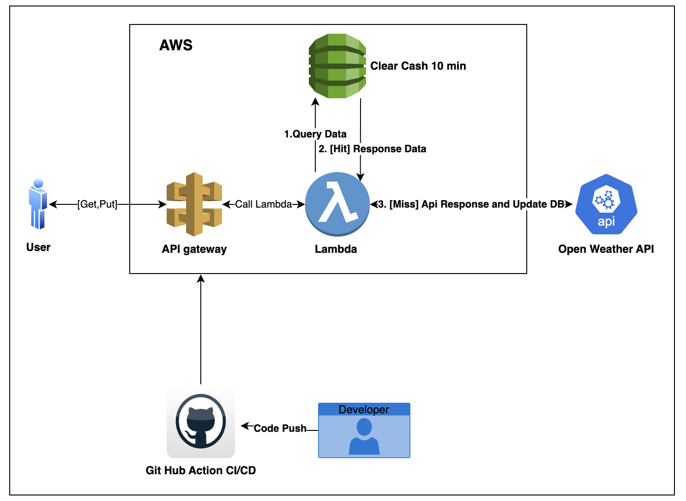

# Weather API Service 🌤️

현대적인 비동기 처리와 AWS Lambda 기반의 확장 가능한 날씨 조회 API 서비스입니다.

[](https://www.python.org/downloads/)
[](https://fastapi.tiangolo.com)
[](https://aws.amazon.com/lambda/)
[](https://aws.amazon.com/cdk/)
[](https://opensource.org/licenses/MIT)


## 🎯 개요

이 프로젝트는 기존의 동기식 Flask 기반 날씨 API를 AWS Lambda와 FastAPI를 활용한 현대적인 서버리스 아키텍처로 리팩토링하고자 합니다.
AWS CDK와 GitHub Actions를 통해 차후 Dev, Stage, PRD의 서비스 계정별 배포와 확장을 용이하게 하고자 합니다.
프로젝트 테스트뿐만 아니라 향후 데이터 분석에 자주 사용되는 날씨 API 데이터 처리를 위한 학습 목적으로도 사용하고자 합니다.

### 핵심 개선사항
- **동기 → 비동기**: Flask에서 FastAPI + AWS Lambda로 전환
- **성능 최적화**: Dynamodb 활용 캐싱
- **확장성**: AWS Lambda의 자동 스케일링 활용
- **견고성**: 지수 백오프 재시도 로직 및 Circuit Breaker 패턴
- **모니터링**: CloudWatch, X-Ray를 통한 완전한 관찰 가능성

## ✨ 주요 기능

| 기능 | 엔드포인트 | 메서드 | 요청 형태 | 특징 |
|------|----------|-------|----------|------|
| **단일 도시 날씨 조회** | `/weather/{city}` | GET | Path Parameter: `city` (도시명) | • 실시간 날씨 정보<br>• DynamoDB 캐싱 (TTL: 10분)<br>• 지수 백오프 재시도 |
| **배치 도시 날씨 조회** | `/weather/batch` | POST | JSON Body: `{"cities": ["Seoul", "Tokyo"]}` | • 최대 50개 도시 동시 조회<br>• 비동기 병렬 처리<br>• 부분 실패 허용 |
| **헬스체크** | `/health` | GET | 요청 파라미터 없음 | • 시스템 상태 점검<br>• 의존성 서비스 확인<br>• 외부 API 연결 상태 |

## 🏗️ 아키텍처

### 시스템 구성도



### AWS 서비스 구성

| 구성요소 | AWS 서비스 | 역할 | 주요 설정 |
|---------|-----------|------|----------|
| **API 엔드포인트** | API Gateway | REST API 제공 | • Rate Limiting<br>• CORS 설정<br>• 요청 라우팅 |
| **컴퓨팅** | Lambda Functions | 서버리스 실행 | • Python 3.11<br>• 비동기 처리<br>• 자동 스케일링 |
| **캐싱** | DynamoDB | 고성능 데이터 저장 | • 10분 TTL<br>• 도시별 캐시 키<br>• 자동 만료 |
| **모니터링** | CloudWatch | 로깅 및 메트릭 | • 실시간 로그<br>• 성능 메트릭<br>• 알람 설정 |
| **추적** | X-Ray | 분산 추적 | • 요청 흐름 추적<br>• 성능 분석<br>• 병목 지점 식별 |
| **외부 API** | OpenWeatherMap | 날씨 데이터 소스 | • RESTful API<br>• 지수 백오프 재시도<br>• Circuit Breaker |

## 🚀 시작하기

### 전제 조건
- Python 3.11+
- AWS CLI 구성
- AWS CDK v2 설치
- uv (Python 패키지 매니저)

### 로컬 개발 환경 설정

1. **저장소 클론**
```bash
git https://github.com/wonny1945/weather-api-service-aws-cdk.git
cd weather-api-service
```

2. **Python 환경 설정 (uv 사용)**
```bash
# 프로젝트 의존성 설치 (개발 의존성 포함)
uv sync

# Lambda와 CDK 의존성은 각각의 requirements.txt로 별도 관리
```

3. **환경 변수 설정**

#### 테스트 및 배포 api 테스트 환경 변수 설정
```bash
# 테스트용 환경 변수 파일 생성
cp .env.local.example .env.local

# .env.local 파일에 다음 값들을 설정:
# TEST_OPENWEATHER_API_KEY=your_openweather_api_key_here
# DEPLOYED_API_ENDPOINT=https://your-api-id.execute-api.ap-northeast-2.amazonaws.com/dev
# AWS_REGION=ap-northeast-2
# AWS_ACCESS_KEY_ID=your_aws_access_key_id
# AWS_SECRET_ACCESS_KEY=your_aws_secret_access_key
# DYNAMODB_TABLE_NAME=WeatherCache-dev
```

> **💡 API 키 획득**: [OpenWeatherMap](https://openweathermap.org/api)에서 무료 API 키를 발급받으세요.


4. **코드 품질 도구 설정 (코드 베이스를 위해 반드시 설치해주세요)**
```bash
# pre-commit 훅 설치 및 활성화
uv run pre-commit install

# pre-commit 훅 수동 실행 (모든 파일 대상)
uv run pre-commit run --all-files
```

> **💡 참고**: pre-commit은 커밋 전에 자동으로 코드 포맷팅과 린팅을 수행합니다. `.pre-commit-config.yaml`에 설정되어 있습니다.

5. **로컬 실행 및 테스트**
```bash
# 로컬 서버 실행
uv run lambda_function/local_dev.py
# 🌐 서버 실행: http://localhost:8000
# 📚 API 문서: http://localhost:8000/docs

# 테스트 실행
uv run pytest

# 코드 포맷팅
uv run black lambda_function/ tests/
```

### 로컬 테스트

> **🔑 중요**: 모든 API 호출에는 OpenWeatherMap API 키가 필요합니다. 쿼리 파라미터(`?api_key=`) 또는 헤더(`X-API-Key`)로 전달하세요.

```bash
# 단일 도시 조회 테스트 (쿼리 파라미터 방식)
curl "http://localhost:8000/weather/Seoul?api_key=YOUR_OPENWEATHER_API_KEY"

# 단일 도시 조회 테스트 (헤더 방식)
curl -H "X-API-Key: YOUR_OPENWEATHER_API_KEY" \
  "http://localhost:8000/weather/Seoul"

# 배치 조회 테스트
curl -X POST "http://localhost:8000/weather/batch?api_key=YOUR_OPENWEATHER_API_KEY" \
  -H "Content-Type: application/json" \
  -d '{"cities": ["Seoul", "Tokyo", "New York"]}'

# 헬스체크
curl "http://localhost:8000/health?api_key=YOUR_OPENWEATHER_API_KEY"

# API 정보 확인 (API 키 불필요)
curl http://localhost:8000/
```

## 📚 API 문서

### 실시간 API 문서
로컬 서버 실행 후 다음 URL에서 확인:
- **Swagger UI**: http://localhost:8000/docs
- **ReDoc**: http://localhost:8000/redoc

### API 응답 예시

#### 단일 도시 조회 성공
```json
{
  "city": "Seoul",
  "country": "KR",
  "temperature": 15.2,
  "description": "Clear sky",
  "humidity": 65,
  "wind_speed": 3.2,
  "cached": true,
  "timestamp": "2024-01-15T10:30:00Z"
}
```

#### 배치 조회 성공
```json
{
  "results": [
    {
      "city": "Seoul",
      "country": "KR",
      "temperature": 15.2,
      "description": "Clear sky",
      "status": "success"
    },
    {
      "city": "InvalidCity",
      "error": "City not found",
      "status": "error"
    }
  ],
  "summary": {
    "total": 2,
    "success": 1,
    "failed": 1
  }
}
```

## 🚀 배포

### AWS CDK를 통한 배포

#### 1. CDK 초기 설정

```bash
# CDK CLI 설치 (전역)
npm install -g aws-cdk

# CDK 의존성 설치
cd infrastructure
pip install -r requirements.txt
```

#### 2. AWS 자격 증명 설정

> **📝 참고**: GitHub Actions를 통한 자동 배포가 구성되어 있지만, 로컬에서 배포할 경우 AWS 자격 증명이 필요합니다.

```bash
# 방법 1: AWS CLI 설정 (권장)
aws configure
# AWS Access Key ID: [your-access-key]
# AWS Secret Access Key: [your-secret-key]
# Default region name: ap-northeast-2
# Default output format: json

# 방법 2: 환경 변수 설정
export AWS_ACCESS_KEY_ID=your-access-key
export AWS_SECRET_ACCESS_KEY=your-secret-key
export AWS_DEFAULT_REGION=ap-northeast-2

# 방법 3: AWS Profile 사용
aws configure --profile weather-api
export AWS_PROFILE=weather-api
```

#### 3. CDK 부트스트랩 (최초 1회)

```bash
cd infrastructure

# 계정과 리전 자동 감지하여 부트스트랩
cdk bootstrap

# 또는 명시적으로 지정
cdk bootstrap aws://ACCOUNT-NUMBER/ap-northeast-2
```

#### 4. 환경별 배포

```bash
cd infrastructure

# 개발 환경 배포 (기본값)
cdk deploy --env dev
# 또는
python app.py --env dev

# 스테이징 환경 배포
cdk deploy --env staging
# 또는
python app.py --env staging

# 프로덕션 환경 배포
cdk deploy --env prod
# 또는
python app.py --env prod

# 특정 계정/리전 지정하여 배포
python app.py --env dev --account 123456789012 --region ap-northeast-2
```

#### 5. 배포 확인

배포 완료 후 다음 정보가 출력됩니다:

```bash
# 출력 예시
✅  WeatherStackAPI-dev
✅  WeatherStackDynamoDB-dev
✅  WeatherStackLambda-dev

Outputs:
WeatherStackAPI-dev.WeatherAPIURL = https://abc123def.execute-api.ap-northeast-2.amazonaws.com/dev/
WeatherStackAPI-dev.WeatherAPIEndpoints =
  Single City: https://abc123def.execute-api.ap-northeast-2.amazonaws.com/dev/weather/{city}
  Batch Cities: https://abc123def.execute-api.ap-northeast-2.amazonaws.com/dev/weather/batch
  Health Check: https://abc123def.execute-api.ap-northeast-2.amazonaws.com/dev/health
```

### 환경별 설정
각 환경은 독립적인 AWS 리소스를 사용하며, 다음과 같이 구분됩니다:

| 환경 | API Gateway | Lambda Memory | ElastiCache | 동시성 제한 |
|------|-------------|---------------|-------------|-------------|
| dev | HTTP API | 512MB | t3.micro | 50 |
| staging | REST API | 1024MB | t3.small | 200 |
| prod | REST API | 1024MB | t3.medium | 1000 |

## 💻 개발

### 프로젝트 구조
```
weather-api-service-aws-cdk/
├── 📁 lambda_function/            # Lambda 애플리케이션 코드
│   ├── __init__.py                # 패키지 초기화
│   ├── lambda_function.py         # 메인 핸들러 (FastAPI 앱)
│   ├── local_dev.py               # 로컬 개발 서버
│   ├── weather_service.py         # 비즈니스 로직
│   ├── cache_service.py           # DynamoDB 캐싱 서비스
│   ├── retry_service.py           # 지수 백오프 재시도 로직
│   ├── external_api.py            # OpenWeatherMap API 클라이언트
│   ├── models.py                  # Pydantic 데이터 모델
│   ├── config.py                  # 환경 설정
│   └── requirements.txt           # Lambda 의존성
│
├── 📁 infrastructure/             # AWS CDK 인프라 코드
│   ├── app.py                     # CDK 앱 진입점
│   ├── cdk.json                   # CDK 설정 및 컨텍스트
│   ├── requirements.txt           # CDK 의존성
│   ├── 📁 stacks/                 # CDK 스택 정의
│   │   ├── __init__.py
│   │   ├── apigateway_stack.py    # API Gateway 스택
│   │   ├── lambda_stack.py        # Lambda 함수 스택
│   │   └── dynamodb_stack.py      # DynamoDB 테이블 스택
│   └── 📁 utils/                  # 유틸리티 모듈
│       ├── __init__.py
│       ├── constants.py           # 상수 정의
│       └── prefixes.py            # 리소스 네이밍 규칙
│
├── 📁 tests/                      # 테스트 코드
│   ├── conftest.py                # pytest 설정 및 픽스처
│   ├── 📁 lambda_function/        # Lambda 함수 테스트
│   │   ├── test_lambda_function.py
│   │   └── test_retry_functionality.py
│   ├── 📁 infrastructure/         # 인프라 테스트
│   │   ├── test_app.py
│   │   ├── test_apigateway_stack.py
│   │   ├── test_lambda_stack.py
│   │   └── test_dynamodb_stack.py
│   └── 📁 service_functionality_test/  # 배포된 서비스 테스트
│       └── test_deployed_service.py
│
├── 📁 .github/                    # GitHub 설정
│   ├── pull_request_template.md   # PR 템플릿
│   └── 📁 workflows/              # GitHub Actions
│       ├── ci.yml                 # 지속적 통합
│       └── cd.yml                 # 지속적 배포
│
├── 📁 docs/                       # 문서
│   └── v.01_architecture.png      # 아키텍처 다이어그램
│
├── main.py                        # 프로젝트 메인 실행 파일
├── pyproject.toml                 # uv 프로젝트 설정
├── uv.lock                        # uv 의존성 락파일
├── CLAUDE.md                      # Claude Code 설정
├── .pre-commit-config.yaml        # pre-commit 훅 설정
├── .env.example                   # 환경 변수 예시
├── .env.local.example             # 배포 테스트용 환경 변수 예시
└── README.md                      # 이 파일
```

### 코딩 규칙
- **PEP 8** 스타일 가이드 준수
- **Type hints** 모든 함수에 적용
- **Docstring** Google 스타일로 작성
- **테스트** 새 기능은 반드시 테스트 코드 포함

### 개발 명령어
```bash
# 테스트
uv run pytest                                      # CI/CD용 테스트 실행 (배포된 서비스 테스트 제외)
uv run pytest tests/service_functionality_test/test_deployed_service.py -s  # 배포된 서비스 테스트(직접실행)

# 코드 품질
uv run black               # 코드 포맷팅
uv run pylint              # 린팅

# 배포
cd infrastructure && cdk deploy WeatherStack-dev   # 개발 환경 배포
```

### 🧪 테스트 분류

이 프로젝트는 다음과 같은 테스트 분류를 사용합니다:

#### Unit/Integration Tests
- **위치**: `tests/lambda_function/`, `tests/infrastructure/`
- **실행**: CI/CD 파이프라인에서 자동 실행
- **목적**: 코드 품질 보장, 로직 검증
```bash
uv run pytest tests/lambda_function/ tests/infrastructure/
```

#### Service Functionality Tests
- **위치**: `tests/service_functionality_test/`
- **실행**: 배포 후 수동 실행 (CI/CD에서 제외)
- **목적**: 실제 배포된 서비스의 기능 및 성능 검증
- **요구사항**:
  - 배포된 AWS 인프라 필요
  - `.env.local` 환경 변수 설정 필요 (`DEPLOYED_API_ENDPOINT`, `TEST_OPENWEATHER_API_KEY` 등)

```bash
# 배포 후 실행할 서비스 기능 테스트
cp .env.local.example .env.local  # 환경 변수 설정
# .env.local 파일에 DEPLOYED_API_ENDPOINT, TEST_OPENWEATHER_API_KEY 등 설정
uv run pytest tests/service_functionality_test/ -s
```

> **⚠️ 중요**: Service Functionality Tests는 실제 AWS 리소스를 사용하므로 비용이 발생할 수 있습니다. 개발 환경에서만 실행하세요.

## 📊 모니터링

### CloudWatch 대시보드
배포 후 AWS 콘솔에서 다음 메트릭을 확인할 수 있습니다:

- **Lambda 메트릭**: 실행 시간, 에러율, 동시성
- **API Gateway 메트릭**: 요청 수, 응답 시간, 4xx/5xx 에러
- **ElastiCache 메트릭**: 캐시 히트율, CPU/메모리 사용률
- **Custom 메트릭**: 외부 API 호출 성공률, 재시도 횟수

### X-Ray 분산 추적
- 요청 플로우 전체 추적
- 병목 지점 식별
- 외부 API 의존성 모니터링
