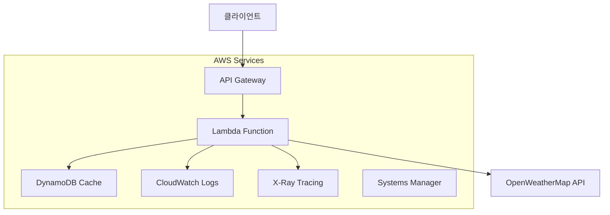
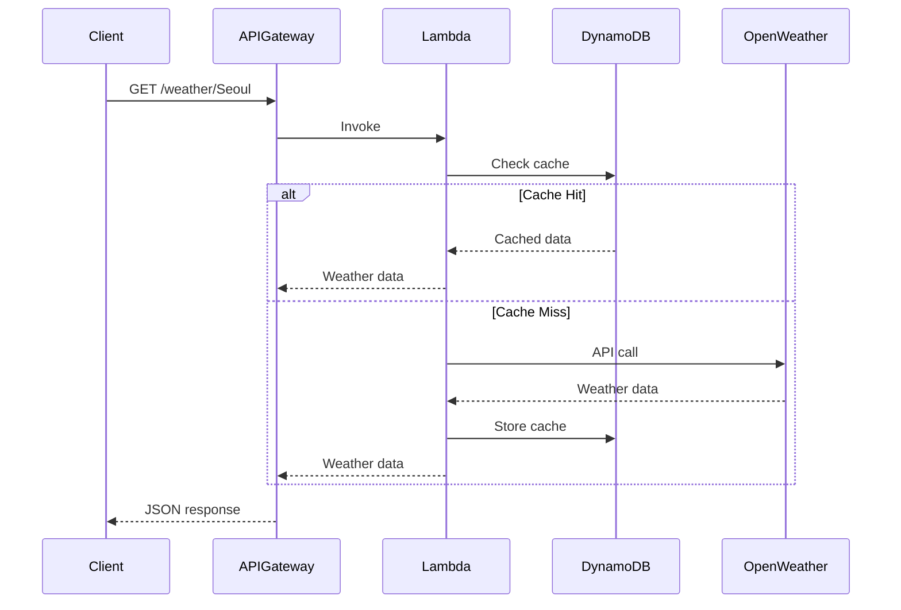
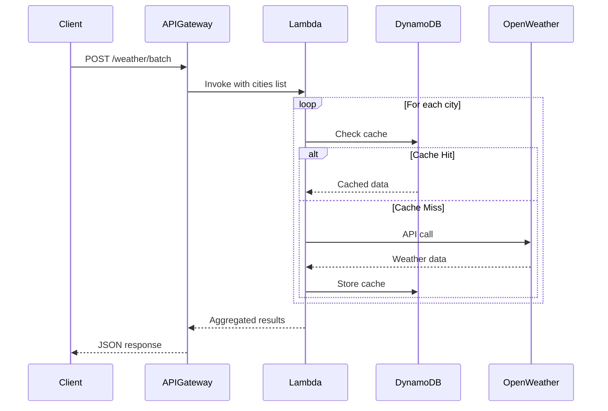

# Weather API 아키텍처 문서

## 개요

이 문서는 AWS Lambda와 FastAPI 기반의 서버리스 날씨 API 서비스 아키텍처를 설명합니다.

## 시스템 아키텍처

### 전체 구성도

### 컴포넌트 구성

#### 1. API Gateway
- **목적**: REST API 엔드포인트 제공
- **기능**:
  - Rate Limiting (환경별 차등 적용)
  - CORS 설정
  - 요청/응답 변환
- **엔드포인트**:
  - `GET /health` - 헬스체크
  - `GET /weather/{city}` - 단일 도시 날씨
  - `POST /weather/batch` - 배치 조회

#### 2. Lambda Function
- **런타임**: Python 3.11
- **메모리**: 512MB (dev) / 1024MB (staging/prod)
- **타임아웃**: 30초 (dev) / 60초 (staging/prod)
- **주요 기능**:
  - 비즈니스 로직 처리
  - 캐시 관리
  - 외부 API 호출
  - 에러 처리 및 재시도

#### 3. DynamoDB
- **목적**: 날씨 데이터 캐싱
- **설정**:
  - 파티션 키: `cache_key` (도시명)
  - TTL: 10분 (`expires_at` 필드)
  - 과금 모드: Pay-per-request
- **성능**: 캐시 히트율 90% 이상 목표

#### 4. External APIs
- **OpenWeatherMap API**
  - 실시간 날씨 데이터 제공
  - API 키는 SSM Parameter Store에 암호화 저장

## 데이터 플로우

### 단일 도시 조회 플로우

### 배치 조회 플로우

## 에러 처리 및 복원력

### 재시도 전략
- **지수 백오프**: 1초 → 2초 → 4초
- **Jitter**: 랜덤 지연 추가 (0-50%)
- **최대 재시도**: 3회

### Circuit Breaker
- **실패 임계값**: 5회 연속 실패
- **복구 시간**: 60초
- **상태**: CLOSED → OPEN → HALF_OPEN

### Graceful Degradation
- 배치 요청 시 일부 도시 실패 허용
- 캐시 실패 시 외부 API 직접 호출
- 부분 응답 제공

## 보안

### API 키 관리
- AWS Systems Manager Parameter Store 사용
- 암호화된 문자열로 저장
- Lambda 실행 시에만 복호화

### 네트워크 보안
- API Gateway CORS 설정
- Lambda 함수는 VPC 외부 배치 (인터넷 접근 필요)
- DynamoDB는 VPC 엔드포인트 사용 고려

### 접근 제어
- IAM 역할 기반 최소 권한 원칙
- API Gateway에서 Rate Limiting
- CloudWatch 로그를 통한 감사

## 모니터링 및 로깅

### 메트릭
- **Lambda**: 실행 시간, 에러율, 동시성
- **API Gateway**: 요청 수, 응답 시간, 4xx/5xx 에러
- **DynamoDB**: 읽기/쓰기 단위, 스로틀링
- **Custom**: 캐시 히트율, 외부 API 성공률

### 로깅
- **구조화된 로그**: JSON 형식
- **로그 레벨**: DEBUG (dev) / INFO (prod)
- **보존 기간**: 1개월 (dev) / 3개월 (prod)

### 추적
- **X-Ray**: 분산 추적 활성화
- **상관관계 ID**: 요청별 고유 ID
- **의존성 맵**: 서비스 간 호출 관계 시각화

## 성능 최적화

### 캐싱 전략
- **TTL**: 10분 (날씨 데이터 특성 고려)
- **캐시 키**: 도시명 (대소문자 정규화)
- **캐시 무효화**: TTL 만료 시 자동

### 동시성 처리
- **배치 요청**: 순차 처리 (API 제한 고려)
- **연결 풀링**: requests 세션 재사용
- **메모리 최적화**: 불필요한 데이터 즉시 해제

### Cold Start 최적화
- **패키지 크기 최소화**: 필수 라이브러리만 포함
- **모듈 지연 로딩**: 필요 시에만 import
- **Provisioned Concurrency**: prod 환경 고려

## 환경별 구성

| 구분 | dev | staging | prod |
|------|-----|---------|------|
| Lambda Memory | 512MB | 1024MB | 1024MB |
| Lambda Timeout | 30s | 60s | 60s |
| API Rate Limit | 100/min | 500/min | 2000/min |
| Log Retention | 1 month | 3 months | 3 months |
| X-Ray Sampling | 100% | 10% | 1% |

## 확장성 고려사항

### 수평 확장
- Lambda 자동 스케일링 활용
- DynamoDB Auto Scaling 설정
- API Gateway 자체적으로 확장

### 수직 확장
- Lambda 메모리 증가로 CPU 성능 향상
- DynamoDB RCU/WCU 조정
- API Gateway 캐싱 활용

### 국제화 확장
- 다중 리전 배포 고려
- 리전별 캐시 분리
- 지역별 외부 API 엔드포인트 사용

## 비용 최적화

### Lambda
- 메모리 크기 최적화
- 실행 시간 단축
- 동시성 제한 설정

### DynamoDB
- Pay-per-request 모드 사용
- TTL 활용한 자동 데이터 삭제
- 필요시 예약 용량 고려

### API Gateway
- 캐싱 활용
- 압축 활성화
- 불필요한 로깅 최소화

## 재해 복구

### 백업
- DynamoDB 자동 백업 활성화
- Lambda 함수 코드 버전 관리
- 인프라 코드 Git 저장소 관리

### 복구 전략
- **RTO**: 30분 이내
- **RPO**: 1시간 이내
- **다중 AZ**: 자동 처리 (Lambda, API Gateway)

### 장애 시나리오
1. **외부 API 장애**: 캐시된 데이터 제공, 오래된 데이터 허용
2. **DynamoDB 장애**: 외부 API 직접 호출
3. **Lambda 장애**: 자동 재시도, 알림 발송
